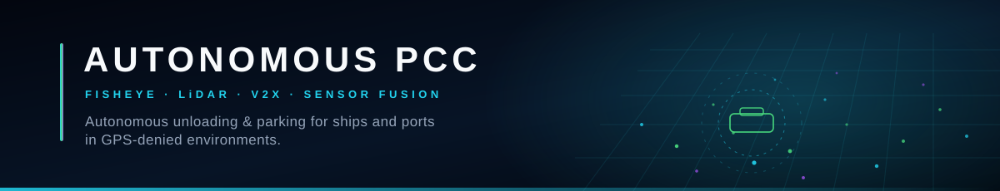
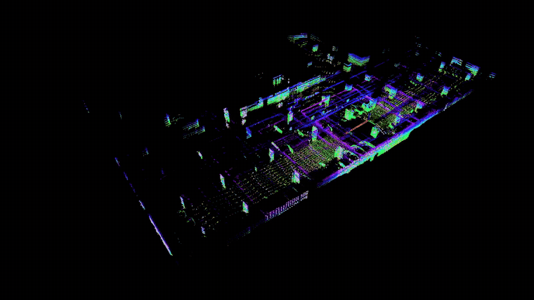
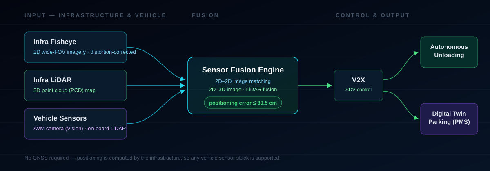
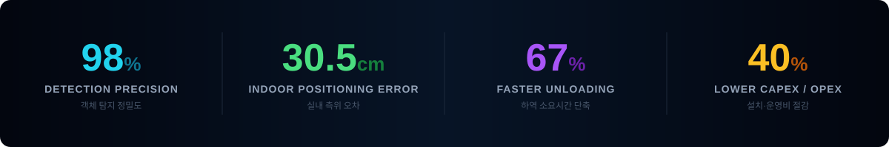

### GPS가 닿지 않는 곳에서, 차가 스스로 내립니다.

선박(PCC)·항만 환경의 GPS 음영 구간에서
어안렌즈·라이다 융합 정밀 측위로 자율주행차의 **무인 하역과 주차**를 자동화합니다.

 

실측 LiDAR 포인트클라우드로 재구성한 주차 구조물 — GPS 없이 인프라만으로 공간을 인식합니다.
▶ [원본 영상 보기 (MP4)](https://d89yicdpi4w1g.cloudfront.net/videos/hero.mp4)

---

## Why Now

자율주행차 수출은 급성장하는데, **배에 싣고 내리는 마지막 구간만 여전히 사람 손**에 있습니다.

| 문제 | 내용 |
|---|---|
| **GPS가 멈춘다** | PCC 선박의 두꺼운 강판과 협소한 선내 구조가 위성 신호를 차단합니다. 기존 GNSS 기반 자율주행이 작동하지 않습니다. |
| **차마다 눈이 다르다** | 테슬라는 비전, BYD는 라이다 — 제조사별 인식 체계가 달라 단일 방식 관제로는 전 차종을 수용할 수 없습니다. |
| **핸들이 사라진다** | 레벨 4 이상 완전 자율주행차에는 핸들이 없습니다. 운전 인력이 직접 이동·주차시키는 방식은 곧 불가능해집니다. |

> 우리는 차량이 아니라 **인프라**를 똑똑하게 만들어 이 문제를 풉니다.
> 차량 사양에 관계없이, 항만과 선내 인프라가 위치를 계산하고 경로를 내려줍니다.

---

## What We Build

### 핵심 기술 5

| # | 기술 | 설명 |
|:--:|---|---|
| 1 | **어안렌즈 2D–2D 영상 융합** | 인프라 어안렌즈 영상과 차량 어라운드뷰(AVM) 영상을 정밀 매칭해 비전 기반 인식 차량의 위치를 추정합니다. 왜곡 보정 학습 데이터로 사각지대 없는 탐지를 확보합니다. |
| 2 | **2D–3D 영상·라이다 센서 퓨전** | 인프라 시각 정보와 3D LiDAR 포인트클라우드(PCD) 맵을 결합해 라이다 기반 인식 차량의 고정밀 공간 좌표를 확보합니다. |
| 3 | **GPS 음영 정밀 측위** | 신호가 차단되는 선박·항만 내부에서 인프라 기반 하이브리드 관제로 실내 측위 오차 30.5cm 이내를 달성합니다. |
| 4 | **V2X 인프라 관제** | 차량–인프라 양방향 통신과 SDV(소프트웨어 중심 차량) 연동으로 선적·하역 전 과정을 인프라가 통합 제어합니다. |
| 5 | **융합 학습 데이터셋** | 어안렌즈(2D)·라이다(3D) 융합 데이터를 COCO·YOLO·PCD 표준 형식으로 구축·라벨링합니다. 얼굴·번호판 비식별 조치를 완료합니다. |

### 솔루션

- **Vision Positioning** — 어안렌즈 2D–2D 비전 측위
- **Sensor Fusion** — 2D–3D 영상·라이다 통합 인식
- **Autonomous Unloading** — 선박·항만 무인 하역 자동화
- **Digital Twin PMS** — 디지털 트윈 기반 주차 최적화

---

## Numbers

고가 라이다 의존도를 낮추고 저비용 어안렌즈 인프라를 활용해, 기존 측위 방식 대비 설치·운영 비용을 40% 이상 절감합니다.

---

## Tech Stack

**Perception & Fusion**
`Python` · `PyTorch` · `OpenCV` · `YOLO` · `Open3D` · `PCL` · `ROS 2`

**Simulation & Validation**
`CARLA` · `AWSIM` · `Autoware`

**Vehicle & Embedded**
`AUTOSAR` · `SDV` · `V2X` · `C/C++` · `On-Device AI`

**Standards**
`ISO 26262` (기능 안전) · `ISO 21448` (SOTIF) · `COCO` / `YOLO` / `PCD`

---

## Repositories

이 조직의 저장소는 다음 축으로 구성됩니다.

| 영역 | 내용 |
|---|---|
| **Perception** | 어안렌즈 왜곡 보정, 객체 탐지, 2D–2D 매칭 파이프라인 |
| **Fusion & Localization** | 영상–라이다 캘리브레이션, PCD 정합, 실내 측위 엔진 |
| **Control & V2X** | 경로 추종, 차량–인프라 통신, SDV 인터페이스 |
| **Dataset Tools** | 라벨링·검수 도구, 비식별 처리, 표준 포맷 변환기 |
| **Simulation** | CARLA / AWSIM 기반 이종 차량 제어 알고리즘 검증 |
| **Web** | 회사 소개 사이트 (Vite + React + Tailwind) |

> 일부 저장소는 지식재산 보호 및 파트너 계약 사유로 비공개로 운영됩니다.

---

## Milestones

| 시기 | 내용 |
|---|---|
| **2026.06** | 데이터바우처 지원사업 선정 — 과학기술정보통신부 |
| **2026.05** | 창업중심대학 선정 — 중소벤처기업부 |
| **2025.12** | AICOSS 산학협력 프로젝트 공모전 장려상 |
| **2025.10** | 예비창업패키지(딥테크 분야) 선정 — 중소벤처기업부 |
| **2025.03** | 한국형 아이코어(K-ICorps) 사업 선정 — 과학기술정보통신부 |
| **2024.12** | SEEK SQUARE 2024 최우수상·인기상 |
| **2024.11** | 임베디드SW경진대회 본선 진출 (5위) |
| **2024.07** | ABEEK 포트폴리오 경진대회 우수상 |
| **2024.06** | AWS 스마트시티 해커톤 본선 진출 (4위) |

---

## Capability

- 자율주행·임베디드 전문 **7인 전담팀**
- **TRL 4~5** 수준 시제품 보유
- **CARLA · AWSIM** 기반 이종 차량 제어 알고리즘 검증 완료
- 자율이동체 경로 추종 등 **특허 3건** 보유, 융합 데이터 위치 추정 시스템 추가 출원 예정

---

## Roadmap

- [x] 어안렌즈 기반 실내 측위 프로토타입 (오차 30.5cm 이내)
- [x] 이종 센서 차량 제어 알고리즘 시뮬레이션 검증
- [ ] 2D–2D / 2D–3D 융합 학습 데이터셋 구축 및 공개
- [ ] 항만 테스트베드 통합 운영 시스템 실증
- [ ] ISO 26262 / 21448 기준 제어 알고리즘 고도화
- [ ] 글로벌 PCTC 선사 대상 SaaS 관제 서비스 확장

---

## Open Data

선박 내부·지하 주차장 등 GPS 음영 환경의 자율주행 학습 데이터는 국내에 거의 없습니다.
우리는 구축한 융합 데이터셋의 일부를 **연구기관·학계에 개방**하여 국가 자율주행 기술 자립에 기여하고자 합니다.

- 어안렌즈(2D) · 라이다(3D) 융합 데이터, JSON/XML 메타데이터 라벨링 포함
- 자율주행 표준 형식(COCO / YOLO / PCD) 채택
- 얼굴·번호판 등 개인정보 비식별(블러·마스킹) 조치 완료 후 공개
- 공공데이터포털 연계 및 오픈 API 제공 예정

---

## Contact

**(주)오토노머스피씨씨** · AUTONOMOUS PCC

분야 · 선박·항만 자율주행 무인 하역 / 정밀 측위
기술 · 어안렌즈·라이다 융합 데이터셋 · V2X 관제

기술 협업 · 실증 파트너십 · 채용 문의를 환영합니다.

